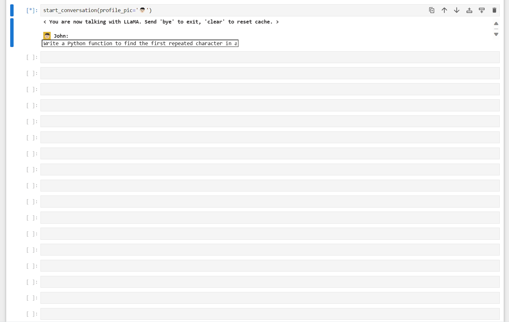
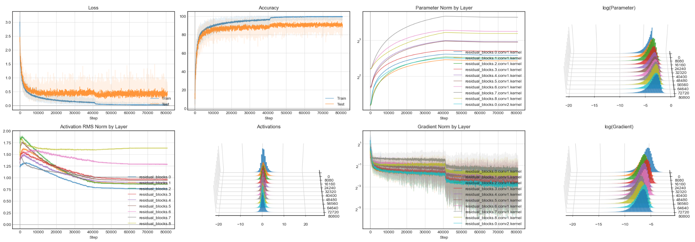

Deep learning library, implemented from scratch in numpy for fun.

#### Features:
* Tensor-based reverse-mode automatic differentiation
* Object-oriented PyTorch-like API
* [Layers](candle/layers): multihead/rotary/grouped-query attention with KV caching, batch/layer/RMS norm, conv2d, max/avg pooling, dropout
* [NLP](candle/nlp): byte-pair encoding, SentencePiece enc/dec, beam search with top-k/nucleus, speculative sampling (todo), chat templates (Llama chat, ChatML)
* Models: [Mixtral](candle/models/mixtral/model.py), [Mamba](candle/models/mamba/model.py), [LLaMA](candle/models/llama/model.py), [GPT](candle/models/gpt/model.py), [ResNet](candle/models/resnet/model.py)
* Lightweight Tensorboard-like dashboarding


## Demos & Experiments

#### Language Modelling
* Chat with Mixtral 8x7B 🌅 [(notebook)](experiments/nlp_experiments/3.3%20Chat%20with%20Mixtral%20(fine-tuned).ipynb) [(model)](candle/models/mixtral/model.py) 
  <p align="center"><br /><sup>(Mixtral 8x7B fine-tuned, video sped up 30x)</sup></p>
* Chat with Mamba 🐍 [(notebook)](experiments/nlp_experiments/3.4%20Chat%20with%20Mamba%20(base).ipynb) [(model)](candle/models/mamba/model.py) 
* Chat with LLaMA 🦙 [(notebook)](experiments/nlp_experiments/3.2%20Chat%20with%20LLaMA%20(fine-tuned).ipynb) [(model)](candle/models/llama/model.py) 
  <p align="center"><br /><sup>(LLaMA 13B fine-tuned, video sped up 30x)</sup></p>
* Chat with GPT2 ⚪ [(notebook)](experiments/nlp_experiments/3.0%20Chat%20with%20GPT2.ipynb) [(model)](candle/models/gpt/model.py) 
* Speculative Sampling experiments [(notebook)](experiments/nlp_experiments/2.1%20Speculative%20Sampling%20Experiments.ipynb)
* KV-caching speedup and memory [(notebook)](experiments/nlp_experiments/2.0%20KV%20Caching%20Speedup%20and%20Memory%20Consumption.ipynb)
* Beam search, top-p, top-k sampling quality [(notebook)](experiments/nlp_experiments/1.0%20Beam%20Search%20vs%20Top%20P%20vs%20Top%20K%20Sampling%20Quality.ipynb)

#### Vision
* Training ResNet20 on CIFAR10 [(notebook)](experiments/vision_experiments/2.0%20ResNet20%20on%20CIFAR10.ipynb)
  <p align="center"></p>

#### Generalization
* Grokking: Generalization Beyond Overfitting (Power et al. 2016) reproduction [(notebook)](experiments/generalization_experiments/1.1%20Reproducing%20Grokking%20-%20Generalization%20Beyond%20Overfitting%20-%2031x31%20modular%20division.ipynb)
  <p align="center"><br /><sup>(long after overfitting, test accuracy suddenly begins increasing — a fun result that feels surprising at first)</sup></p>


## Example GPT2 Implementation

```python
import numpy as np
import candle
import candle.functions as F
from candle import Module, Tensor


class GPT(Module):
    
    def __init__(self,
                 n_layers: int,
                 n_heads: int,
                 embed_dim: int,
                 vocab_size: int,
                 block_size: int,
                 dropout_p: float):
        super().__init__()
        
        self.n_layers = n_layers
        self.embed_dim = embed_dim
        self.block_size = block_size
        
        self.dropout = candle.Dropout(dropout_p)
        self.word_embeddings = candle.Embedding(vocab_size, embed_dim)
        self.position_embeddings = candle.Embedding(block_size, embed_dim)
        self.decoder_blocks = candle.ParameterList([DecoderBlock(embed_dim, n_heads, dropout_p)
                                                    for _ in range(n_layers)])
        self.layer_norm = candle.LayerNorm(embed_dim)
        
        # Tie output projection weights to word embeddings. See "Weight Tying" paper.
        self.output_projection = self.word_embeddings.embeddings
        
    
    def forward(self,
                indices: Tensor,
                use_kv_cache: bool = False):
        offset = self.get_kv_cache_seqlen() if use_kv_cache else 0
        position_indices = Tensor(np.arange(indices.shape[1]) + offset)
        
        x = self.word_embeddings(indices) + self.position_embeddings(position_indices)
        x = self.dropout(x)  # shape (batch, seqlen, embed_dim)

        for decoder_block in self.decoder_blocks:
            x = decoder_block(x, use_kv_cache)

        x = self.layer_norm(x)
        
        return x @ self.output_projection.T


    def get_kv_cache_seqlen(self):
        """Gets KV cache seqlen."""
        return self.decoder_blocks[0].attn.get_kv_cache_seqlen()

    
class DecoderBlock(Module):
    
    def __init__(self,
                 embed_dim: int,
                 n_heads: int,
                 dropout_p: float):
        super().__init__()
        self.dropout = candle.Dropout(dropout_p)
        
        self.ln1 = candle.LayerNorm(embed_dim)
        self.attn = candle.MultiheadAttention(embed_dim, n_heads, dropout_p, batch_first=True)
        self.ln2 = candle.LayerNorm(embed_dim)
        self.ffn = FeedForwardBlock(input_dim=embed_dim, hidden_dim=4 * embed_dim)

        
    def forward(self,
                x: Tensor,
                use_kv_cache: bool):
        # x: Tensor with shape (batch, seqlen, embed_dim)
        x = x + self.dropout(self.self_attn(self.ln1(x), use_kv_cache))
        x = x + self.dropout(self.ffn(self.ln2(x)))

        return x

    
    def self_attn(self,
                  x: Tensor,
                  use_kv_cache: bool):
        """Self-attention with causal mask."""
        # causal_attn_mask[i, j] = 0 means that query[i] attends to key[j], and so
        # causal_attn_mask[i, j] = 0 if i >= j and 1 otherwise.
        causal_attn_mask = Tensor(1 - np.tri(x.shape[1]))

        (attn_output, attn_scores) = self.attn(x, x, x,
                                               attn_mask=causal_attn_mask,
                                               use_kv_cache=use_kv_cache)

        return attn_output
    
    
class FeedForwardBlock(Module):
    
    def __init__(self,
                 input_dim: int,
                 hidden_dim: int):
        super().__init__()
        self.linear1 = candle.Linear(input_dim, hidden_dim)
        self.linear2 = candle.Linear(hidden_dim, input_dim)
        
        
    def forward(self, x):
        x = self.linear1(x)
        x = F.gelu(x)
        x = self.linear2(x)
        
        return x
```

#### Example Backprop
```python
model = GPT(n_layers=12,
            n_heads=12,
            embed_dim=768,
            vocab_size=50257,
            block_size=1024,
            dropout_p=0.1)

tokenizer = candle.models.gpt.GPT2BPETokenizer()
indices = candle.Tensor([tokenizer.encode(
    'Once upon a time, there is a cat whose name is Maukoo. He loves eating and cuddling.'
)])

targets = indices[:, 1:]
logits = model(indices[:, :-1])
loss = F.cross_entropy_loss(logits, targets)
loss.backward()
```

#### Example generation
```python
model = candle.models.gpt.GPT.from_pretrained('gpt2-large')

with candle.no_grad():
    generator = candle.nlp.beam_search_decoder(model, indices[0],
                                               n_tokens_to_generate=50,
                                               beam_size=1,
                                               top_p=0.90,
                                               top_k=100,
                                               use_kv_cache=True)

    response_indices = np.concatenate(list(generator))

print(tokenizer.decode(response_indices))
# Output:  A lot.  He also loves drinking.  (But it's an odd habit for a cat that loves eating
# and cuddling.)  This little kitty is not the sort of kitty you would expect to be a
```


## Run Tests

`python -m unittest`
